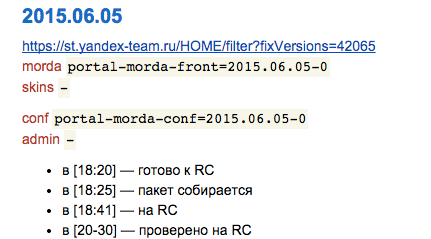
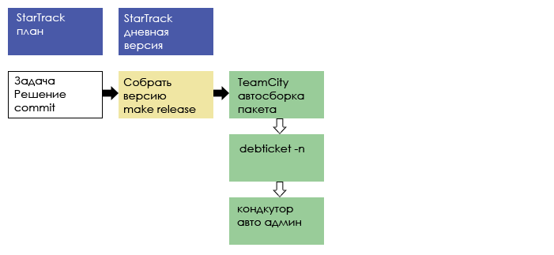
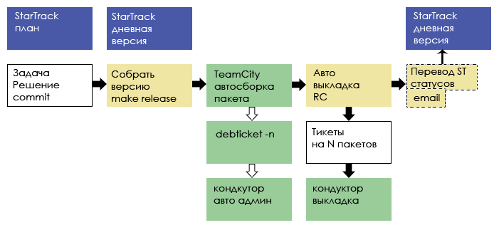
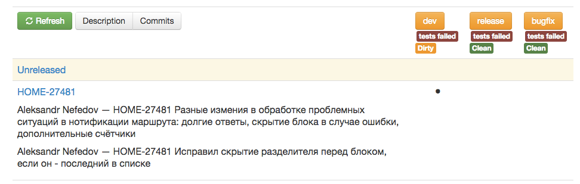
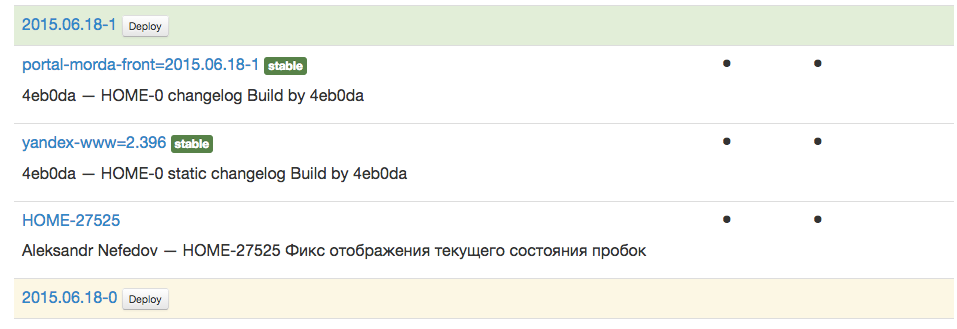
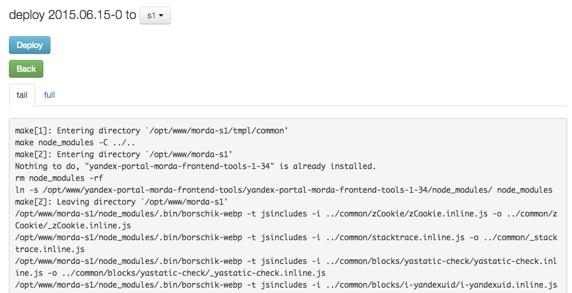

---

layout: default

title: make release

---

# Яндекс

##  {:.cover}

## **{{ page.title }}** {#cover}

    
HOME

<!--

-->

	
{{ site.author.name }},   {{ site.author.position }}

## Обзор
{:.section}

### Организация релиза

## Проект и команда

* Главная страница: www.yandex.ru
    * debian пакеты
	* 4 основных пакета, 2 репозитория
	* 20 человек
	* Ежедневные релизы
	* git-flow 

## Проект и команда

* Главная страница: www.yandex.ru
    * debian пакеты
	* 4 основных пакета, 2 репозитория
	* 20 человек
	* Ежедневные релизы
* git-flow
    * dev
    * release
    * bugfix === hotfix

## Что такое релиз

* Таск 
* Решение, коммит, push
* Сборка пакета (15-30мин)
* Релиз Кандидат (60мин)
* Продакшен (30-60мин)
* Откат или Хот-Фикс

## wiki страничка: morda/release

{:.right-image}

* Какую версию? 
* Какие пакеты?
* Инструкции Админам
* Ход релиза
* История

## Цепочка Релиза

* Желтое -  автоматизация морды
* Зеленое - готовая инфраструктура

## Цепочка Релиза

* Желтое -  автоматизация морды
* Зеленое - готовая инфраструктура

## Инструмент
{:.section}

### make release

## Что такое make release
* `release_utils.pl` aka `make release`
	* https://github.yandex-team.ru/morda/gitrelease
* Решает Задачу: получить `debian/changelog`
    * покоммитные изменения
	* контроль названий версий
	* мердж веток по git-flow
	* решение конфликтов
	* итерирование версий подрепозиториев

##  make release
* Решает Задачу: получить `debian/changelog`
* покоммитные изменения
	* контроль названий версий
	* мердж веток по git-flow
	* решение конфликтов
	* итерирование версий подрепозиториев

##  make release
* Решает Задачу: получить `debian/changelog`
	* покоммитные изменения
* контроль названий версий
	* мердж веток по git-flow
	* решение конфликтов
	* итерирование версий подрепозиториев

##  make release
* Решает Задачу: получить `debian/changelog`
	* покоммитные изменения
    * контроль названий версий
* мердж веток по git-flow
	* решение конфликтов
	* итерирование версий подрепозиториев

##  make release
* Решает Задачу: получить `debian/changelog`
	* покоммитные изменения
    * контроль названий версий
    * мердж веток по git-flow
* решение конфликтов после git-flow
	* итерирование версий подпакетов

##  make release
* Решает Задачу: получить `debian/changelog`
	* покоммитные изменения
    * контроль названий версий
    * мердж веток по git-flow
    * решение конфликтов после git-flow
* итерирование версий подпакетов

## Алтернатива dch -i

~~~ javascript
cat debian/release_utils.conf
{
    flow => {
        master => {
            release => q{master},
        },
    },
    package_version_type => 'MajorMinor'
}
~~~

~~~ javascript
yandex-digits-front (1.40) unstable; urgency=low
  * 93c4f3f124189d3c86af7ebaae0606656e3677dc | MIke NIkitin <mellior@yandex-team.ru> | Mon Jun 8 19:34:30 2015 +0300
      PASSP-11791: Поднять Капчу в MANе, ipv6only mode for finland, mixed mode for others
          404 as static files for unknown keys
 -- Mike Nikitin <buildfarm@yandex-team.ru>  Mon, 08 Jun 2015 19:35:16 +0300
~~~

## git-flow

~~~ clike
{
    flow => {
        dev => {
            release         => 'release',
            back_merge      => [qw/master dev/],
            conflict_accept => q{debian/changelog},
        },
        release =>{
            release         => 'release',
            back_merge      => [qw/master dev/],
            conflict_accept => q{debian/changelog},
        },
        bugfix => {
            release         => 'bugfix',
            back_merge      => [qw/master dev/]
            conflict_reject => q{debian/changelog},
        },
    },
    package_version_type => 'DateMinor',
}
~~~

## Под пакеты

* Пакет скинов
* Пакет статики

~~~ javascript
{
    prerun                => [
        "cd ./tmpl/skins/; ../../release_utils/make_release.pl $run_options --no-push --no-back-merge",
        "cd ./tmpl/; ../release_utils/make_release.pl $run_options --no-push --no-back-merge",
    ],
}
~~~ 

## Условное итерирование

~~~ javascript
{
    watch_files          => [
        qr{^tmpl/skins},
        qr{^tmpl/skins/debian},
    ],
    ignore_files         => [
        qr{(content|hash|page|config|index|skins|server)\.js$},
        sub {
            !m{bemjson\.js$} and
            m{tmpl/v12/pages-desktop/(?:[^\/]+)/[^\/]+\.js},
        },
        qr{priv\.js$},
     ],
}
~~~

## Чем проще тем лучше 

* Одна команда

~~~ clike
mellior@v23:/opt/www/morda-v23d2 (git: dev)
make release
~~~

~~~ clike
mellior@v23:/opt/www/morda-v23d2 (git: release)
make release
~~~

~~~ clike
mellior@v23:/opt/www/morda-v23d2 (git: bugfix)
make release
~~~

* Кнопка

## Инструмент
{:.section}

### Web версия 

## Web
{:.center}

## Web версия

* Запуск make release на сервере 
    * сохранение логов
    * обзор коммитов
    * Состояние пакетов
    * Состояние тестов 
    * Развертывание дев сервера

## Web версия

* Запуск make release на сервере с сохранением логов
* обзор коммитов

    * Состояние пакетов
    * Состояние тестов 
    * Развертывание дев сервера

## Web версия

* Запуск make release на сервере 
* Состояние пакетов

    * привет пакистан :)

## Web версия

* Запуск make release на сервере 
    * сохранение логов
    * Состояние пакетов
* Состояние тестов 
* Развертывание дев сервера

## Web версия

* Запуск make release на сервере 
    * сохранение логов
    * Состояние пакетов
    * Состояние тестов 
    * Развертывание дев сервера
* Запуск по кнопке

## Логи
{:.center}

## Что еще можно атвтоматизировать?

## Что еще можно атвтоматизировать?

* Работа с несколькими репозиториями

* Перевод состояний тасков после коммита
* Отбивка о тасках, которые выкатились пакетами

## Что еще можно атвтоматизировать?

* Работа с несколькими репозиториями
* Перевод состояний тасков после коммита
    * Ready For Commit -> Commited
* Отбивка о тасках, которые выкатились пакетами

## Что еще можно атвтоматизировать?

* Работа с несколькими репозиториями
* Перевод состояний тасков после коммита
* Отбивка о тасках, которые выкатились пакетами

~~~ clike
Обновлён пакет "portal-morda-front" на RC.

Версии:
- предыдущая: 2015.06.10-1;
- текущая: 2015.06.11-0.

Изменения в текущей версии:
   * 'Version incremented by'
   * d8381098ebe35f7d51f60333a1d3521cbbe3188c | Savenkova Natalya <wwax@yandex-team.ru> | Mon Jun 8 13:52:57 2015 +0300
        HOME-21499 - Нормальное определение "развлекательных" каналов для ТВ (Normal Task)
   * 8184732c59cbdecd09c558ea7259bf83961dea83 | MIke NIkitin <mellior@yandex-team.ru> | Wed Jun 10 19:54:25 2015 +0300
        HOME-27412 - Сделать новый эксперимент для геотачевой морды geocontext_fuid2 (Critical Task)
~~~

## **Контакты** {#contacts}

{{ site.author.name }}

   
    

        
https://github.yandex-team.ru/morda/gitrelease

        
mellior@yandex-team.ru

        
    

