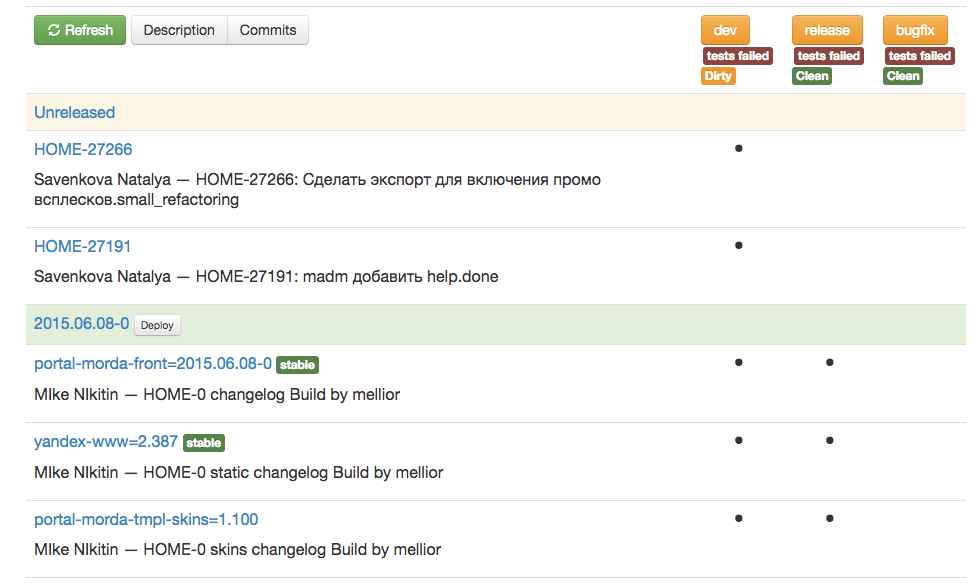

---

layout: default

title: make release

---

# Яндекс

## **{{ page.title }}** {#cover}

    
HOME

<!--

-->

	
{{ site.author.name }},   {{ site.author.position }}

## Обзор
{:.section}

### Организация релиза

## Проект и команда

* Главная страница: www.yandex.ru
    * debian пакеты
	* 4 основных пакета, 2 репозитория
	* 10 разработчиков, 5 тестировшиков, 3 админа
	* Ежедневные релизы
	* git-flow c основными ветками `dev`+`release`, `bugfix`

## Что такое релиз

* Таск 
* Решение, тестирование, коммит, Еще коммит, push
* Сборка пакета
* Выкладка и тестирование РелизКандидата (RC)
* Выкладка в продакшн
* Откат или Хот-Фикс

## wiki страничка: morda/release

{:.right-image}

* Какую версию?
* Какие пакеты?
* Доп. Инструкции Админам
* Ход релиза
* История
    * Что выкатили 20ого?
    * На что откатывать?

## Автоматизация Релиза

## Инструмент
{:.section}

### make release

## Что это?
* `release_utils.pl` aka `make release`
	* https://github.yandex-team.ru/morda/gitrelease
* Задачи
	* покоммитные изменения в `debian/changelog`
	* контроль названий версий
	* мердж веток по git-flow
	* решение конфликтов
	* итерирование версий подрепозиториев

## Алтернатива dch -i

~~~ javascript
cat debian/release_utils.conf
{
    flow => {
        master => {
            release => q{master},
        },
    },
    package_version_type => 'MajorMinor'
}
~~~

~~~ javascript
yandex-digits-front (1.40) unstable; urgency=low
  * 93c4f3f124189d3c86af7ebaae0606656e3677dc | MIke NIkitin <mellior@yandex-team.ru> | Mon Jun 8 19:34:30 2015 +0300
      PASSP-11791: Поднять Капчу в MANе, ipv6only mode for finland, mixed mode for others
          404 as static files for unknown keys
 -- Mike Nikitin <buildfarm@yandex-team.ru>  Mon, 08 Jun 2015 19:35:16 +0300
~~~

## git-flow
~~~ javascript
{
    flow => {
        dev => {
            release         => 'release',
            back_merge      => [qw/master dev/],
            conflict_accept => q{debian/changelog},
        },
        release =>{
            release         => 'release',
            back_merge      => [qw/master dev/],
            conflict_accept => q{debian/changelog},
        },
        bugfix => {
            release         => 'bugfix',
            back_merge      => [qw/master dev/]
            conflict_reject => q{debian/changelog},
        },
    },
    package_version_type => 'DateMinor',
}
~~~

## Одна команда

~~~
mellior@v23:/opt/www/morda-v23d2 (git: dev)
make release
~~~

~~~
mellior@v23:/opt/www/morda-v23d2 (git: release)
make release
~~~

~~~
mellior@v23:/opt/www/morda-v23d2 (git: bugfix)
make release
~~~

## Под репозитории

* Пакет скинов
* Пакет статики

~~~ javascript
{
    prerun                => [
        "cd ./tmpl/skins/; ../../release_utils/make_release.pl $run_options --no-push --no-back-merge",
        "cd ./tmpl/; ../release_utils/make_release.pl $run_options --no-push --no-back-merge",
    ],
}
~~~ 

## Условное итерирование

~~~ javascript
{
    watch_files          => [
        qr{^tmpl/skins},
        qr{^tmpl/skins/debian},
    ],
    ignore_files         => [
        qr{(content|hash|page|config|index|skins|server)\.js$},
        sub {
            !m{bemjson\.js$} and
            m{tmpl/v12/pages-desktop/(?:[^\/]+)/[^\/]+\.js},
        },
        qr{priv\.js$},
     ],
}
~~~

## Инструмент
{:.section}

### Web версия 

## Web
{:.center}

## Задачи

* Запуск make release на сервере с сохранением логов
* Контроль коммитов
    * Какие задачи в каких ветках
* Состояние пакетов: выкатился да/нет
* Состояние тестов 
* Развертывание дев сервера

## Логи
{:.center}

## Задачи которые предстоит решить

* Работа с несколькими репозиториями
* Перевод состояний тасков после коммита
* Формирование дневной версии
* Формирование полных тикетов и инструкций
* Отбивка о тасках, которые выкатились пакетами

## **Контакты** {#contacts}

{{ site.author.name }}

   
    

        
https://github.yandex-team.ru/morda/gitrelease

        
mellior@yandex-team.ru

        
    

